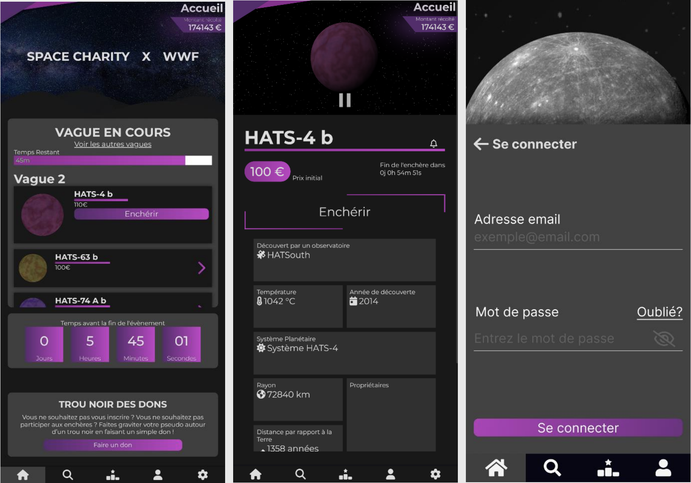

Space-charity is a (fake) real-time auction application. It was developed as an academical project in the 2nd year of my bachelor's degree.

## Project instructions

Develop a collaborative, real-time client-server auction application for individuals (B2C or C2C). Auctions may involve personal property or real estate.

Some more details:
- There are different auction mechanisms. We needed to explore them, choose one, and
analyze the specific features that would impact our requirements.
- We also needed to clearly define the type of assets that would be put into auction, and verify that there are no restrictive regulations applying to them

## Why "Space Charity"

We had the idea of using objects that should not be able to be put to auction: **planets and stars**.

Our idea for this project was then to host a charity event, where people would auction for planets and stars (a bit like NFTs), and then the money would be donated to charities.

## Application development

We went through the following phases:
- **Project scope** (objectives, context analysis, state of the art, identification of constraints and risks, risk management analysis)
- **Requirements specification** (business processes, functional requirements, non-functional requirements, software quality criteria, usability criteria)
- **Implementation** (planning, team organization, approach, site infrastructure, file directory infrastructure, database definition and implementation)

Here is the 40 pages report that contains everything about the app and was used to track each criteria defined above: <a href="./DossierProjet-team09.pdf" target="_blank">:file_folder: Space Charity design report</a> (in french only).

## Image gallery

Space charity public views.


Public views on a phone:

Administrator-only views


<!-- 
- Il existe de nombreux mécanismes d’enchères. Vous devrez les explorer, en choisir un et
analyser en analyser les spécificités qui impacteront vos spécifications.
- Avant de vous lancer pensez :
→ A bien définir le type de biens sur lesquels vous souhaitez travailler et à vérifier qu’il n’existe pas de réglementation
restrictive dans le domaine.
→ A définir l’organisation de votre équipe et à vous répartir les rôles.
→ A définir et planifier votre travail
→ Et, à définir et mettre en place votre environnement de travail

Créer, au sein d'une équipe, une application client-serveur sécurisée s'appuyant sur une
base de données en partant d'un besoin décrit de manière succincte. Vous devrez :
→ collecter et formaliser le besoin
→ développer une application communicante
- intégrant la manipulation des données et
- respectant les paradigmes de qualité (ergonomie des IHM, qualité logicielle, sécurité…) -->

<!-- As part of a team, create a secure client-server application based on a
database, starting from a briefly described requirement. You will need to:
→ gather and formalize the requirement
→ develop a networked application
- that incorporates data manipulation and
- adheres to quality standards (HMI usability, software quality, security, etc.) -->
